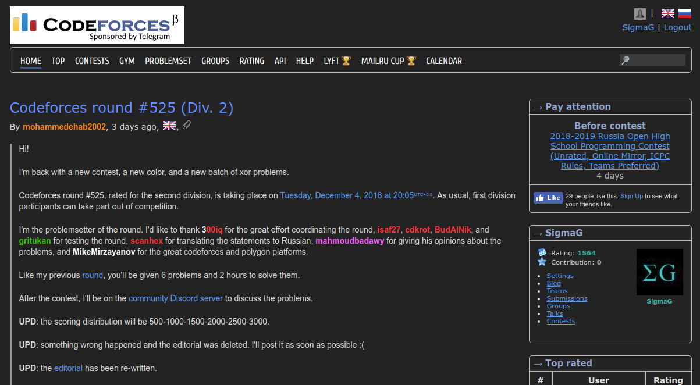

# Codeforces Dark Theme

A dark theme for Codeforces. [**Click to install**](https://github.com/GaurangTandon/codeforces-darktheme/raw/master/codeforces-darktheme.user.js) (requires a userscript manager)

**Accessibility in mind**: All colors used clear the minimum AA accessibility contrast ratio of 4.5:1, while most of them also clear the AAA contrast ratio of 7:1.

## Download instructions

1. Install Tampermonkey for your browser. ([Instructions](https://tampermonkey.net/)).
2. [**Click this link**](https://github.com/GaurangTandon/codeforces-darktheme/raw/master/codeforces-darktheme.user.js) to install Codeforces dark theme userscript.

In case the script is updated later, you need not revisit the page. Tampermonkey auto fetches new updates every 24hrs by default. 

In case you're getting this warning:

> Apps, extensions, and user scripts can not be added from this website.

This warning is mainly to prevent vulnerable users from installing malicious extensions and apps. In my case, you can trust this userscript as its code is posted on GitHub, under public scrutiny. So, you can safely ignore the warning and proceed with installation.

## Notes

1. **Rating color adjustments**: User handle colors needed to be reworked to be nice with the latest dark theme. That means the following colors now appear only ever so differently, but the sharp eyes amongst you may notice ;) These color adjustments are only meant to **improve contrast ratio of text** against a dark background.

    | users                                        | original color                                                            |                             new color                              |
    | -------------------------------------------- | ------------------------------------------------------------------------- | :----------------------------------------------------------------: |
    | admins, non-rated, first letter of legendary | black (`#000`)                                                            |                           white (`#fff`)                           |
    | Grandmaster                                  |  red                  |  `#ff4747` |
    | Candidate master                             |  violet            |  `#ce8aff` |
    | Expert                                       |  blue                |  `#757dff` |
    | Specialist                                   |  cyan (`#03a89e`)    |  `#01bdb2` |
    | Pupil                                        |  green (`#00d700`) |  `#00c700` |
    | Newbie                                       |  gray                |  `#8c8c8c` |

    To view all the color changes at once, view the table on the [blog post "Second Revolution of Colors and Titles"](https://codeforces.com/blog/entry/20638).

## External dependencies

Both are for dark theme syntax highlighting of code.

1. [prettyprint's desert.css](https://github.com/google/code-prettify/blob/master/styles/desert.css), since Codeforces depends on the same library for formatting submission's display ([Apache license](https://github.com/google/code-prettify/blob/master/COPYING)).
2. [Ace editor's monokai.css](https://github.com/ajaxorg/ace/blob/master/lib/ace/theme/monokai.css) since Codeforces' submission codebox uses the Ace editor ([BSD license](https://github.com/ajaxorg/ace/blob/master/LICENSE)).

## Contribution guidelines

PRs are most welcome! Though it may be better to first create an issue describing the problem the PR fixes and then create it, in order to get more alternate views on the problem.

## License

MIT License attached.
